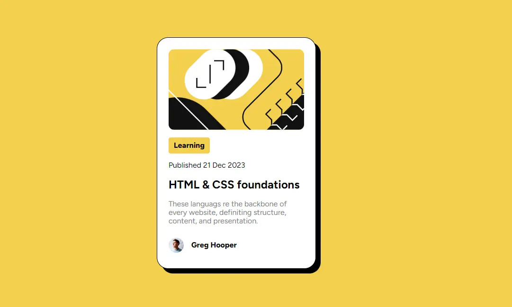

# Blog Preview Card | [Visit Here](#)

## Tech used:  

I created this blog-post preview card with HTML and CSS. I used nested CSS to target the hover active state. 

## More Projects:

Take a look at these other projects I've done:

**Birth Month Flower API & Client:** https://github.com/jenieg/flower-name-client

**Guess that Pokemon:** https://github.com/jenieg/Guess-That-Pokemon
